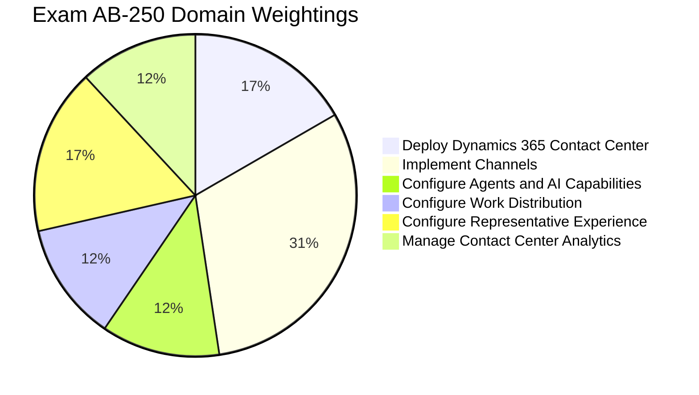
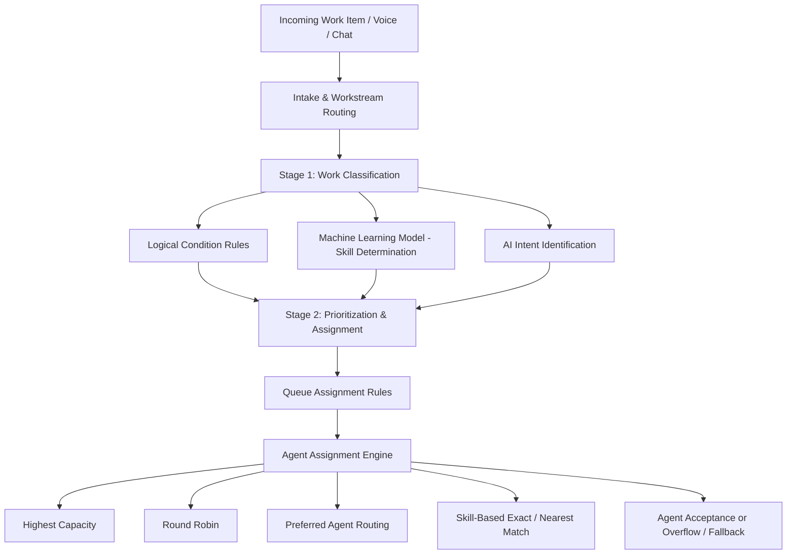

# New Microsoft Certified: Dynamics 365 Contact Center AI Engineer Associate Certification

---

## 📖 Table of Contents
1. [Exam Overview](#-exam-overview)
2. [How to Prepare](#-how-to-prepare)
3. [Exam Blueprint & Skills Measured](#-exam-blueprint--skills-measured)
4. [In-Depth Complex Topics Breakdown](#-in-depth-complex-topics-breakdown)
   - [1. Deploying Dynamics 365 Contact Center & Enterprise Architecture](#1-deploying-dynamics-365-contact-center--enterprise-architecture)
   - [2. Omnichannel Communication & Voice Infrastructure](#2-omnichannel-communication--voice-infrastructure)
   - [3. Autonomous Agents, Copilot Studio & Generative AI](#3-autonomous-agents-copilot-studio--generative-ai)
   - [4. Unified Routing, Workstreams & AI-Enabled Routing](#4-unified-routing-workstreams--ai-enabled-routing)
   - [5. Representative Productivity, Workspace & Extensibility](#5-representative-productivity-workspace--extensibility)
   - [6. Supervisor Experience, Quality Evaluation & Telemetry Analytics](#6-supervisor-experience-quality-evaluation--telemetry-analytics)
5. [Detailed Topic Documentation Index](#-detailed-topic-documentation-index)
6. [Official Microsoft Learning Resources](#-official-microsoft-learning-resources)

---

## 🎯 Exam Overview

The **Exam AB-250: Transforming Contact Center Experiences with AI in Dynamics 365** validates expertise in designing, implementing, configuring, and optimizing AI-powered contact center solutions within **Microsoft Dynamics 365 Contact Center**. 

This credential establishes proficiency in modernizing customer support environments by blending human representatives with autonomous AI agents, multi-channel engagement, and generative artificial intelligence.

### Quick Facts & Details
| Attribute | Specification |
| :--- | :--- |
| **Exam Code** | **AB-250** |
| **Certification Name** | **Microsoft Certified: Dynamics 365 Contact Center AI Engineer Associate** |
| **Exam Title** | Transforming Contact Center Experiences with AI in Dynamics 365 |
| **Exam Level** | Associate (Intermediate / Advanced Engineering) |
| **Status** | Beta Exam |
| **Passing Score** | 700 / 1000 (Scaled Score) |
| **Question Types** | Multiple Choice, Case Studies, Drag-and-Drop, Sequence Ordering, Scenario-Based Analysis |
| **Target Role** | Contact Center Engineers, Solution Architects, AI Engineers, CCaaS Implementation Consultants |
| **Technology Stack** | Dynamics 365 Contact Center, Microsoft Copilot Studio, Azure Communication Services, Azure AI, Power Platform, Power BI, Microsoft Teams, Microsoft Foundry |

### Target Audience Profile
Candidates for this exam are contact center engineers or solutions professionals who design, implement, and support AI-powered contact center solutions by using Microsoft Dynamics 365 Contact Center and service-oriented autonomous agents. Candidates should possess practical experience with:
- Translating business and customer service requirements into scalable, compliant, secure contact center solutions.
- Configuring unified routing, omnichannel communication (voice, chat, digital, and social), and capacity models.
- Building, extending, and orchestrating generative AI agents using Microsoft Copilot Studio.
- Customizing representative workspaces, application profiles, productivity scripts, and JavaScript APIs.
- Designing enterprise reporting, supervisor dashboards, Power BI data models, and Azure Application Insights telemetry.

---

## 🚀 How to Prepare

Follow these structured official preparation steps to ensure readiness for Exam AB-250:

- 🔗 **Review the Exam AB-250 (beta) page for exam registration and other details:**  
  Visit the [Official Microsoft Exam AB-250 Registration & Certification Details Page](https://learn.microsoft.com/en-us/credentials/certifications/d365-contact-center-ai-engineer-associate/) to review exam policies, scheduling options via Pearson VUE, system requirements, and language availability.
  
- 📚 **The Exam AB-250 study guide explores key topics covered in the exam:**  
  Consult the [Official Microsoft Exam AB-250 Study Guide](https://learn.microsoft.com/en-us/credentials/certifications/resources/study-guides/ab-250) for a line-by-line itemization of every skill, objective, and update measured on the test.

- 👥 **Connect with Microsoft Training Services Partners in your area for in-person offerings:**  
  Accelerate your learning through instructor-led, hands-on enterprise workshops delivered by accredited Microsoft partners worldwide. Find authorized partners at the [Microsoft Training Services Partner Directory](https://learn.microsoft.com/en-us/credentials/support/help#training-services-partners).

- 💡 **Need other preparation ideas? Check out Just How Does One Prepare for Beta Exams?:**  
  Beta exams have unique scoring timelines and lack third-party study guides. Review the official Microsoft guide: [Just How Does One Prepare for Beta Exams? (Microsoft Community Hub)](https://techcommunity.microsoft.com/blog/skills-hub-blog/just-how-does-one-prepare-for-beta-exams/1469421) and [About Beta Certification Exams](https://learn.microsoft.com/en-us/credentials/support/about-beta-exams).

---

## 📊 Exam Blueprint & Skills Measured

The exam syllabus is organized into six core functional domains:

| Domain | Weighting | Key Focus Areas |
| :--- | :---: | :--- |
| **Domain 1: Deploy Dynamics 365 Contact Center** | **15–20%** | Copilot Service workspace, connectors, standalone vs embedded mode, third-party CCaaS integration, Agent hub, ALM, security roles, personas, capacity profiles. |
| **Domain 2: Implement Channels** | **30–35%** | Chat, digital messaging, Live Chat SDK, Voice channel provisioning, phone numbers, calling profiles, non-Microsoft IVR integration, proactive campaigns, WFM. |
| **Domain 3: Configure Agents and AI Capabilities** | **10–15%** | Copilot summaries, Ask a question, prompt plugins & tools, generative AI IVR, Copilot Studio voice triggers, Real-time Speech agent, DTMF, NLU, multilingual agents. |
| **Domain 4: Configure Work Distribution** | **10–15%** | Queues, prioritization, overflow/fallback, assignment methods, workstreams, classification rules, skills-based routing, AI routing, intent routing, diagnostics. |
| **Domain 5: Configure Representative Experience** | **15–20%** | App profiles, tab templates, agent inbox, session templates, notifications, macros, scripts, slugs, Teams collaboration, knowledge management, JavaScript APIs. |
| **Domain 6: Manage Contact Center Analytics** | **10–15%** | Supervisor app, Quality Evaluation agent, Power BI embedded reports, Power BI Desktop extensions, Application Insights diagnostics, real-time & historical telemetry. |

---

## 🔬 In-Depth Complex Topics Breakdown

### 1. Deploying Dynamics 365 Contact Center & Enterprise Architecture
Deploying Dynamics 365 Contact Center requires selecting between deployment topologies and configuring tenant-wide infrastructure:
- **Deployment Topologies**:
  - *Standalone CCaaS*: Full omnichannel cloud contact center natively hosted on Dynamics 365 and Azure Communication Services.
  - *Embedded Mode*: Integrating Dynamics 365 Contact Center capabilities directly into third-party CRM systems (such as Salesforce, ServiceNow, or custom web portals).
  - *Copilot for 3rd-Party CCaaS*: Supercharging existing legacy telephony (e.g., Genesys, Cisco, Avaya) with Microsoft Generative AI Copilot and agent assist.
- **Security & Personas**:
  - Role-Based Access Control (RBAC): D365 Administrator, Omnichannel Administrator, Omnichannel Supervisor, Omnichannel Representative.
  - Personas and User Settings: Mapping specialized profiles to operational tiers.
  - Capacity Profiles: Defining units of work (e.g., Voice = 100 units, Chat = 30 units from a total representative capacity of 100).
- **Application Lifecycle Management (ALM)**:
  - Solution packaging of workstreams, queues, automated messages, and Copilot Studio bots across Dev, Test, and Production environments using Power Platform CLI and Azure DevOps pipelines.
  - Health Agent and Journey Simulation: Pre-flight testing customer journeys before production go-live.

### 2. Omnichannel Communication & Voice Infrastructure
Channel configuration is the largest exam domain (30–35%):
- **Voice Channel Architecture**:
  - Provisioning phone numbers (Toll-Free, Geographic) via Azure Communication Services or Bring Your Own Carrier (BYOC) Direct Routing / SBC.
  - Inbound and Outbound calling profiles, emergency calling configurations, operating hours, and voice workstream bindings.
  - Non-Microsoft IVR Integration: Utilizing the CCaaS SDK API to bridge external telephony systems with unified routing.
  - Call recording, live transcription, real-time translation, and sentiment analysis pipeline.
- **Digital Channels & Messaging**:
  - Web Chat: Embedding responsive chat widgets, proactive chat triggers, and pre-chat surveys.
  - Live Chat SDK & Mobile SDK: Integrating custom chat interfaces into native iOS/Android applications.
  - Asynchronous Channels: SMS, Apple Messages for Business, WhatsApp, and custom messaging endpoints via Azure Event Grid and messaging APIs.
  - Proactive Outbound Campaigns: Automated dialers (Predictive, Power, Preview), trigger-based customer notifications, and outbound dashboard tracking.
  - Workforce Management (WFM): Scheduling, shift allocation, demand forecasting, and third-party WFM connectors.

### 3. Autonomous Agents, Copilot Studio & Generative AI
Exam AB-250 focuses heavily on intelligent automation:
- **Copilot Studio Integration**:
  - Generative AI IVR vs Classic Rule-Based Dialogs.
  - Speech Synthesis (TTS) and Natural Language Understanding (NLU) fine-tuning for voice bots.
  - Handling Dual-Tone Multi-Frequency (DTMF) inputs and speech barge-in.
  - SIP Header Transfers: Seamlessly handing off voice calls from self-service bots to human queues with context metadata preservation.
  - Multilingual voice and text agents with real-time language detection.
- **Agent Assist & Generative Copilot**:
  - Live Conversation Summaries: Real-time generation of multi-turn customer interaction summaries.
  - "Ask a Question" feature: Grounding Copilot responses in internal SharePoint, Dataverse knowledge bases, and public URLs.
  - Extending Copilot with Prompt Plugins and Power Platform Connectors.
  - Autonomous System Agents: The *Customer Knowledge Management Agent*, *Health Agent*, and *Real-Time Speech Agent*.

### 4. Unified Routing, Workstreams & AI-Enabled Routing
The Unified Routing engine processes incoming work items in two distinct phases:

- **Stage 1 - Work Classification**:
  - Attaching context variables, customer identification records, and priority flags.
  - AI-enabled skills prediction: Extracting keywords and sentiment to attach technical skills dynamically.
  - Intent-based classification: Mapping natural language customer queries to predefined intent taxonomies.
- **Stage 2 - Route-to-Queue & Assignment Methods**:
  - Prioritization Rules: Determining work item processing order based on SLA deadlines or customer VIP tier.
  - Assignment algorithms: *Highest Capacity*, *Round Robin*, *Preferred Representative*, and *Skills-Based Routing* (Exact Match vs Closest Match).
  - Overflow Management: Handling queue limits, max wait times, and out-of-hours routing with automated fallback.
  - Conversation Diagnostics: Tracing individual routing execution paths to debug classification logic.

### 5. Representative Productivity, Workspace & Extensibility
Empowering contact center agents with streamlined UI and automation:
- **App Profile Manager & Workspace Configuration**:
  - Designing multi-session Experience Profiles, application tab templates, and custom Agent Inbox views.
  - Notification Templates: Configuring sound alerts, visual banners, and desktop push notifications.
- **Productivity Tools & Automation**:
  - Smart Assist Bots: Recommending relevant knowledge articles and next-best actions.
  - Agent Scripts: Step-by-step guidance scripts with dynamic data insertion using **Slugs** (e.g., `{customer_name}`, `{case_id}`).
  - Macros: Automating multi-step repetitive tasks (e.g., auto-resolving cases, sending emails, updating Dataverse records) with a single click.
  - Microsoft Teams Swarming: Collaborative problem solving embedded directly into agent sessions.
  - JavaScript Extensibility: Utilizing the Omnichannel JavaScript API (`Microsoft.Omnichannel.*`) and App Profile Manager API to build custom web resources.

### 6. Supervisor Experience, Quality Evaluation & Telemetry Analytics
Providing management with real-time operational insights and AI-driven quality governance:
- **Supervisor Experience**:
  - Omnichannel Ongoing Conversations Dashboard: Monitoring live sessions, agent status, and customer sentiment.
  - Supervisor Actions: Monitor, Join, Whisper, and Force-Transfer live interactions.
  - Quality Evaluation Agent: Automatically scoring conversations against quality rubrics, compliance criteria, and empathy metrics.
- **Reporting & Business Intelligence**:
  - Out-of-the-box Power BI Analytics: Historical reports (Conversations, Agents, Queues, Bot Performance) and Real-Time dashboards.
  - Customizing KPIs: Editing embedded Power BI reports directly in the workspace or authoring custom `.pbix` templates in Power BI Desktop.
  - Azure Application Insights: Ingesting raw telemetry, conversation diagnostics, latency metrics, and API call logs for enterprise monitoring.

---

## 📂 Detailed Topic Documentation Index

For detailed architectural diagrams, step-by-step configuration walkthroughs, and practice scenarios, refer to the individual domain guides:

- 📘 [01. Deploy Dynamics 365 Contact Center](./docs/01-deploy-dynamics-365-contact-center.md)
- 📘 [02. Implement Channels (Voice, Chat, Digital, WFM)](./docs/02-implement-channels.md)
- 📘 [03. Configure Agents, Copilot Studio & AI Capabilities](./docs/03-configure-agents-and-ai-capabilities.md)
- 📘 [04. Configure Work Distribution & Unified Routing](./docs/04-configure-work-distribution.md)
- 📘 [05. Configure Representative Experience & Productivity](./docs/05-configure-representative-experience.md)
- 📘 [06. Manage Contact Center Analytics & Telemetry](./docs/06-manage-contact-center-analytics.md)
- 📘 [07. Official Resources, Documentation & Links](./docs/07-official-resources-and-links.md)

---

## 🌐 Official Microsoft Learning Resources

- 🌐 [Microsoft Certified: Dynamics 365 Contact Center AI Engineer Associate Certification Page](https://learn.microsoft.com/en-us/credentials/certifications/d365-contact-center-ai-engineer-associate/)
- 🌐 [Official Exam AB-250 Study Guide](https://learn.microsoft.com/en-us/credentials/certifications/resources/study-guides/ab-250)
- 🌐 [Microsoft Learn: Dynamics 365 Contact Center Documentation](https://learn.microsoft.com/en-us/dynamics365/contact-center/)
- 🌐 [Microsoft Copilot Studio Documentation](https://learn.microsoft.com/en-us/microsoft-copilot-studio/)
- 🌐 [About Beta Certification Exams](https://learn.microsoft.com/en-us/credentials/support/about-beta-exams)
- 🌐 [Just How Does One Prepare for Beta Exams? (Liberty Munson Blog)](https://techcommunity.microsoft.com/blog/skills-hub-blog/just-how-does-one-prepare-for-beta-exams/1469421)
- 🌐 [Microsoft Training Services Partner Directory](https://learn.microsoft.com/en-us/credentials/support/help#training-services-partners)

---

### 🛡️ Disclaimer
*This repository contains educational study notes, architecture summaries, and reference documentation compiled exclusively from publicly available official Microsoft Learn documentation and technical resources. Microsoft, Dynamics 365, Copilot Studio, Azure, and Microsoft Teams are trademarks of the Microsoft group of companies.*
