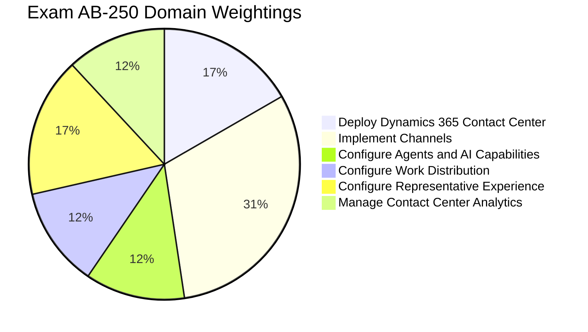

# New Microsoft Certified: Dynamics 365 Contact Center AI Engineer Associate Certification

---

## 📖 Table of Contents
1. [Exam Overview](#-exam-overview)
2. [How to Prepare](#-how-to-prepare)
3. [Exam Blueprint & Skills Measured](#-exam-blueprint--skills-measured)
4. [In-Depth Complex Topics Breakdown](#-in-depth-complex-topics-breakdown)
5. [Practice & Preparation Materials](#-practice--preparation-materials)
6. [10 Exam Demo Practice Questions & Answers](#-10-exam-demo-practice-questions--answers)
7. [Community Discussion & Study Group](#-community-discussion--study-group)
8. [Detailed Topic Documentation Index](#-detailed-topic-documentation-index)
9. [Official Microsoft Learning Resources](#-official-microsoft-learning-resources)

---

## 🎯 Exam Overview

The **Exam AB-250: Transforming Contact Center Experiences with AI in Dynamics 365** validates expertise in designing, implementing, configuring, and optimizing AI-powered contact center solutions within **Microsoft Dynamics 365 Contact Center**.

### Quick Facts & Details
| Attribute | Specification |
| :--- | :--- |
| **Exam Code** | **AB-250** |
| **Certification Name** | **Microsoft Certified: Dynamics 365 Contact Center AI Engineer Associate** |
| **Exam Title** | Transforming Contact Center Experiences with AI in Dynamics 365 |
| **Exam Level** | Associate (Intermediate / Advanced Engineering) |
| **Status** | Beta Exam |
| **Passing Score** | 700 / 1000 (Scaled Score) |
| **Target Role** | Contact Center Engineers, Solution Architects, AI Engineers, CCaaS Implementation Consultants |

---

## 🚀 How to Prepare

- 🔗 **Review the Exam AB-250 (beta) page for exam registration and other details:**  
  Visit the [Microsoft Exam AB-250 Registration & Certification Details Page](https://learn.microsoft.com/en-us/credentials/certifications/d365-contact-center-ai-engineer-associate/) to review exam policies and scheduling via Pearson VUE.
  
- 📚 **The Exam AB-250 study guide explores key topics covered in the exam:**  
  Consult the [Official Microsoft Exam AB-250 Study Guide](https://learn.microsoft.com/en-us/credentials/certifications/resources/study-guides/ab-250) for an itemization of all measured objectives.

- 👥 **Connect with Microsoft Training Services Partners in your area for in-person offerings:**  
  Find authorized partners at the [Microsoft Training Services Partner Directory](https://learn.microsoft.com/en-us/credentials/support/help#training-services-partners).

- 💡 **Need other preparation ideas? Check out Just How Does One Prepare for Beta Exams?:**  
  Read official tips: [Just How Does One Prepare for Beta Exams? (Microsoft Community Hub)](https://techcommunity.microsoft.com/blog/skills-hub-blog/just-how-does-one-prepare-for-beta-exams/1469421) and [About Beta Certification Exams](https://learn.microsoft.com/en-us/credentials/support/about-beta-exams).

---

## 📊 Exam Blueprint & Skills Measured

| Domain | Weighting | Key Focus Areas |
| :--- | :---: | :--- |
| **Domain 1: Deploy Dynamics 365 Contact Center** | **15–20%** | Copilot Service workspace, connectors, standalone vs embedded mode, third-party CCaaS integration, Agent hub, ALM, security roles, personas, capacity profiles. |
| **Domain 2: Implement Channels** | **30–35%** | Chat, digital messaging, Live Chat SDK, Voice channel provisioning, phone numbers, calling profiles, non-Microsoft IVR integration, proactive campaigns, WFM. |
| **Domain 3: Configure Agents and AI Capabilities** | **10–15%** | Copilot summaries, Ask a question, prompt plugins & tools, generative AI IVR, Copilot Studio voice triggers, Real-time Speech agent, DTMF, NLU, multilingual agents. |
| **Domain 4: Configure Work Distribution** | **10–15%** | Queues, prioritization, overflow/fallback, assignment methods, workstreams, classification rules, skills-based routing, AI routing, intent routing, diagnostics. |
| **Domain 5: Configure Representative Experience** | **15–20%** | App profiles, tab templates, agent inbox, session templates, notifications, macros, scripts, slugs, Teams collaboration, knowledge management, JavaScript APIs. |
| **Domain 6: Manage Contact Center Analytics** | **10–15%** | Supervisor app, Quality Evaluation agent, Power BI embedded reports, Power BI Desktop extensions, Application Insights diagnostics, real-time & historical telemetry. |

---

## 💡 Practice & Preparation Materials

For additional high-yield practice questions, scenario walk-throughs, and mock testing simulations to assess your exam readiness, review the comprehensive practice materials available for [AB-250](https://www.certsclub.com/microsoft/).

---

## 📝 10 Exam Demo Practice Questions & Answers

### Question 1 (Domain 2: Voice Channel & IVR Handoff)
**Scenario:** A financial services company implements Dynamics 365 Contact Center with Microsoft Copilot Studio for voice self-service. When an authenticated customer requests to speak with a human agent, the customer's account number and verified security token must be passed to the human representative without requiring re-authentication. What should you configure?
- A) Configure Live Chat SDK variables and trigger a Webhook.
- B) Configure SIP header data passing in Copilot Studio and map context variables in the voice workstream.
- C) Create a Dataverse custom table and store caller credentials during the call.
- D) Configure an outbound calling profile with DTMF override.
- **Correct Answer:** **B**
- **Explanation:** In Dynamics 365 Contact Center voice channels, Copilot Studio passes conversational context and caller variables to human agents using SIP user-to-user headers. These are extracted and mapped into workstream context variables within Unified Routing.

---

### Question 2 (Domain 4: Unified Routing & Work Distribution)
**Scenario:** An enterprise needs to route incoming customer support chats. In peak hours, if an exact skills match is not available within 45 seconds, the system should assign the chat to an agent with the closest matching skill set to avoid excessive customer abandonment. Which assignment method should you configure?
- A) Round Robin Assignment
- B) Skills-Based Routing with Exact Match
- C) Skills-Based Routing with Closest Match (Relaxation Rule)
- D) Highest Available Capacity without skills
- **Correct Answer:** **C**
- **Explanation:** Skills-Based Routing with Closest Match applies skill relaxation logic, progressively dropping optional skill requirements after defined wait time thresholds to ensure timely agent connection.

---

### Question 3 (Domain 5: Representative Experience & App Profile Manager)
**Scenario:** You need to configure the workspace for Tier 2 Technical Support agents so that whenever a chat session is accepted, the Customer Summary form opens automatically alongside an internal SharePoint Knowledge Portal tab. Which configuration entity controls this behavior?
- A) Notification Template
- B) Session Template and Application Tab Templates
- C) Workstream Classification Rules
- D) Unified Routing Prioritization Rule
- **Correct Answer:** **B**
- **Explanation:** Session Templates within the App Profile Manager define the anchor tab and default application tabs (configured via Application Tab Templates) that open automatically upon session acceptance.

---

### Question 4 (Domain 3: AI Capabilities & Copilot Grounding)
**Scenario:** You are configuring Copilot in Dynamics 365 Contact Center to enable the "Ask a Question" feature for agents. You want Copilot to generate answers grounded in verified enterprise policy documents stored in a secure SharePoint Online folder. What should you configure?
- A) Export policy documents into Dataverse Notes records.
- B) Configure SharePoint as a Knowledge Source in Copilot settings with Azure AD authentication.
- C) Create an Azure Logic App to parse PDFs and push plain text into chat widgets.
- D) Build a custom macro that opens SharePoint in a browser window.
- **Correct Answer:** **B**
- **Explanation:** Copilot in Dynamics 365 supports native Knowledge Sources including SharePoint Online. Grounding allows Copilot to perform semantic retrieval with security trimming based on the agent's Azure AD permissions.

---

### Question 5 (Domain 1: Deployment & Capacity Management)
**Scenario:** A contact center representative handles both voice and live chat. You must ensure that when an agent is on an active voice call (which consumes 100 capacity units), they receive no chat requests (which consume 30 units each), even if their base capacity is 100. How should you configure capacity profiles?
- A) Set reset frequency to End of Day on the chat profile.
- B) Assign a blocking capacity profile with 100 units to the voice channel workstream.
- C) Create separate user logins for voice and chat.
- D) Enable manual presence override for representative statuses.
- **Correct Answer:** **B**
- **Explanation:** When a workstream is configured with a blocking capacity profile of 100 units, assigning a voice call consumes all 100 units, blocking assignment of any other work items until the session ends.

---

### Question 6 (Domain 2: Digital Channels & Live Chat SDK)
**Scenario:** A company wants to embed a customized live chat widget into their native iOS mobile app and authenticate users using their existing mobile login credentials. Which solution should you implement?
- A) Standard web iframe widget embedded in a mobile webview.
- B) Messaging SDK for Dynamics 365 Contact Center with OAuth 2.0 / OpenID Connect authentication provider.
- C) WhatsApp Business Channel with SMS fallback.
- D) Power Pages Portal embedded within the application.
- **Correct Answer:** **B**
- **Explanation:** The Messaging SDK for Dynamics 365 Contact Center provides native iOS/Android libraries supporting authenticated sessions via OpenID Connect tokens.

---

### Question 7 (Domain 6: Analytics & Supervisor Experience)
**Scenario:** A contact center supervisor notices an ongoing voice conversation where customer sentiment has dropped to 'Very Negative'. The supervisor needs to provide immediate advice to the agent without the customer hearing the guidance. Which supervisor action should be used?
- A) Monitor
- B) Whisper
- C) Join
- D) Force Transfer
- **Correct Answer:** **B**
- **Explanation:** The 'Whisper' feature allows supervisors to inject one-way audio or private chat messages directly to the representative without the customer being aware of the supervisor's participation.

---

### Question 8 (Domain 3: Copilot Studio Voice Triggers & DTMF)
**Scenario:** An IVR voice agent in Copilot Studio asks callers for a 6-digit PIN code. In noisy environments, speech recognition occasionally misinterprets spoken digits. How should you optimize the voice bot?
- A) Increase speech timeout to 60 seconds.
- B) Enable Dual-Tone Multi-Frequency (DTMF) keypad input on the Question node.
- C) Force callers to transfer to human representatives.
- D) Use a Power Automate flow to guess the PIN.
- **Correct Answer:** **B**
- **Explanation:** Enabling DTMF on Copilot Studio voice nodes allows callers to enter numbers using telephone keypads, ensuring accurate digit capture in noisy environments.

---

### Question 9 (Domain 5: Agent Productivity & Macros)
**Scenario:** You need to automate the case creation process so that when an agent clicks a button in the Productivity pane, the system automatically creates a Case record, populates the Customer ID from the active session context, and links the ongoing conversation. Which tool should you configure?
- A) Power BI Embedded Report
- B) Productivity Macro using Omnichannel Macro Connector actions and Slugs
- C) Dataverse Classic Workflow
- D) Agent Notification Template
- **Correct Answer:** **B**
- **Explanation:** Macros in Dynamics 365 Contact Center execute sequential automated actions. Contextual data from the active session is passed dynamically into macro fields using slugs (e.g., `{customer_id}`).

---

### Question 10 (Domain 6: Telemetry & Application Insights)
**Scenario:** An enterprise needs to analyze detailed routing execution paths, SDK latency, and WebRTC call quality metrics for all Dynamics 365 Contact Center interactions across global regions. Which service should you configure?
- A) Dataverse Audit Logs
- B) Azure Application Insights with Conversation Diagnostics integration
- C) Excel export from Agent Inbox
- D) Power Apps Monitor
- **Correct Answer:** **B**
- **Explanation:** Dynamics 365 Contact Center integrates directly with Azure Application Insights to stream high-fidelity telemetry, conversation diagnostics, and WebRTC media metrics for advanced querying via KQL.

---

## 💬 Community Discussion & Study Group

Have questions about Exam AB-250 topics, architecture designs, or beta exam experiences?
- 💬 **Ask a question or start a topic:** [GitHub Discussions](https://github.com/Jason-smithy/AB-250/discussions)
- 🐛 **Report inaccuracies or suggest updates:** [GitHub Issues](https://github.com/Jason-smithy/AB-250/issues)
- 🤝 **Contribution Guide:** Feel free to open a Pull Request with updated notes, architectural diagrams, or study materials!

---

## 📂 Detailed Topic Documentation Index

- 📘 [01. Deploy Dynamics 365 Contact Center](./docs/01-deploy-dynamics-365-contact-center.md)
- 📘 [02. Implement Channels (Voice, Chat, Digital, WFM)](./docs/02-implement-channels.md)
- 📘 [03. Configure Agents, Copilot Studio & AI Capabilities](./docs/03-configure-agents-and-ai-capabilities.md)
- 📘 [04. Configure Work Distribution & Unified Routing](./docs/04-configure-work-distribution.md)
- 📘 [05. Configure Representative Experience & Productivity](./docs/05-configure-representative-experience.md)
- 📘 [06. Manage Contact Center Analytics & Telemetry](./docs/06-manage-contact-center-analytics.md)
- 📘 [07. Official Resources, Documentation & Links](./docs/07-official-resources-and-links.md)

---

## 🌐 Official Microsoft Learning Resources

- 🌐 [Microsoft Certified: Dynamics 365 Contact Center AI Engineer Associate Certification Page](https://learn.microsoft.com/en-us/credentials/certifications/d365-contact-center-ai-engineer-associate/)
- 🌐 [Official Exam AB-250 Study Guide](https://learn.microsoft.com/en-us/credentials/certifications/resources/study-guides/ab-250)
- 🌐 [Microsoft Learn: Dynamics 365 Contact Center Documentation](https://learn.microsoft.com/en-us/dynamics365/contact-center/)
- 🌐 [Microsoft Copilot Studio Documentation](https://learn.microsoft.com/en-us/microsoft-copilot-studio/)
- 🌐 [About Beta Certification Exams](https://learn.microsoft.com/en-us/credentials/support/about-beta-exams)
- 🌐 [Just How Does One Prepare for Beta Exams? (Liberty Munson Blog)](https://techcommunity.microsoft.com/blog/skills-hub-blog/just-how-does-one-prepare-for-beta-exams/1469421)
- 🌐 [Microsoft Training Services Partner Directory](https://learn.microsoft.com/en-us/credentials/support/help#training-services-partners)

---

### 🛡️ Disclaimer
*This repository contains educational study notes, architecture summaries, and reference documentation compiled exclusively from publicly available official Microsoft Learn documentation and technical resources. Microsoft, Dynamics 365, Copilot Studio, Azure, and Microsoft Teams are trademarks of the Microsoft group of companies.*
