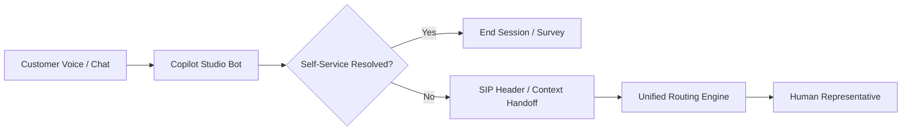

# Domain 3: Configure Agents and AI Capabilities (10–15%)

## 3.1 Copilot for Contact Center & Generative AI
Microsoft Copilot transforms agent productivity and autonomous customer resolution:

### Core Copilot Features
- **Live Conversation Summaries**: Real-time generative summarization of customer issues, troubleshooting steps taken, and resolution status.
- **Ask a Question**: Natural language query interface allowing agents to query enterprise knowledge bases, SharePoint sites, and Dataverse tables.
- **Copilot Prompt Plugins**: Extending Copilot with specialized business actions using Power Platform connectors and AI prompts.
- **Copilot Analytics**: Measuring agent adoption, query success rates, resolution time impact, and user feedback ratings.

---

## 3.2 Copilot Studio Voice & Chat Agents
Building intelligent conversational agents with Microsoft Copilot Studio:

### Voice Bot Capabilities
- **Speech Synthesis (TTS) & NLU**: Customizing neural voices, pronunciation lexicons, and multi-turn dialog understanding.
- **Dual-Tone Multi-Frequency (DTMF)**: Supporting keypad input alongside speech recognition.
- **Real-Time Speech Agent**: Low-latency voice processing for interruption handling and natural conversational flow.
- **Compliant Call Recording**: Pausing/resuming recordings programmatically during sensitive data transmission (e.g., credit card numbers).
- **Multilingual Support**: Real-time automatic language translation across 40+ languages for voice and digital channels.

---

## 3.3 Autonomous Specialized Agents
- **Customer Knowledge Management Agent**: Automatically identifies knowledge gaps from unresolved cases and generates draft knowledge base articles.
- **Smart Assist Bot**: Evaluates live transcript context to push contextual articles and macro recommendations to the agent's productivity panel.

---

## 3.4 References
- [Copilot in Dynamics 365 Contact Center](https://learn.microsoft.com/en-us/dynamics365/contact-center/use/use-copilot-features)
- [Microsoft Copilot Studio Documentation](https://learn.microsoft.com/en-us/microsoft-copilot-studio/)
